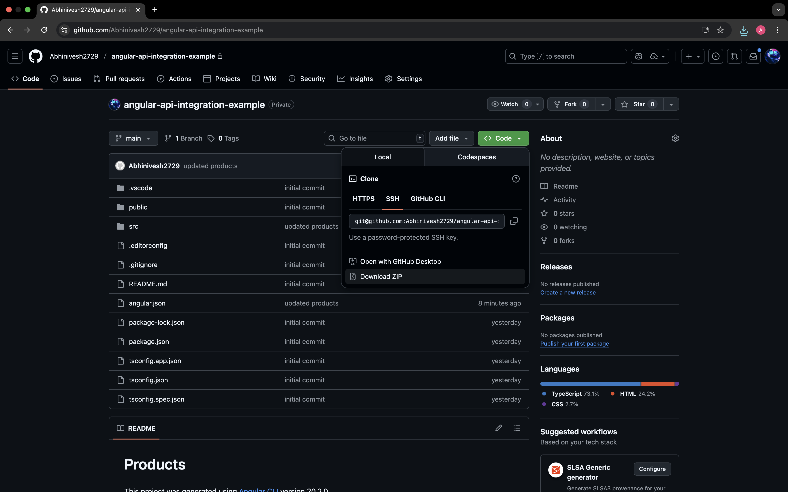

# Products Store - Angular API Integration Project

A simple Angular application that demonstrates API integration by fetching and displaying products from a REST API in a responsive grid layout.

## 🎯 About This Project

This project is a product showcase application built with **Angular 20** that demonstrates:
- **API Integration** - Fetching data from external REST APIs
- **Component-based Architecture** - Modern Angular standalone components
- **Responsive Design** - Grid layout that adapts to different screen sizes
- **Data Binding** - Dynamic content rendering with Angular templates
- **HTTP Client** - Making HTTP requests to external APIs

### What You'll See
The application displays a "My Store" interface showing products with:
- Product images
- Product names/titles
- Product prices
- Responsive grid layout

## 🛠️ Technologies & Concepts Used

### Core Technologies
- **Angular 20.2.0** - Latest Angular framework
- **TypeScript 5.9.2** - Type-safe JavaScript superset

## 🚀 How to Run This Project

### Prerequisites
Make sure you have the following installed on your computer:
- **Node.js** (version 18 or higher) - [Download here](https://nodejs.org/)
- **npm** (comes with Node.js) or **yarn**

### Step-by-Step Instructions

1. **Download the Source Code Zip file**
    
   - Download the source code zip file (refer to the screenshot above: img1.png)
   - Extract the zip file and you will get a folder called `angular-api-integration-example-main` in your Downloads folder

3. **Open Terminal/Command Prompt**
   - On Windows: Press `Win + R`, type `cmd`, press Enter
   - On Mac: Press `Cmd + Space`, type `terminal`, press Enter
   - On Linux: Press `Ctrl + Alt + T`

4. **Navigate to Project Directory**
   
   **For Windows:**
   Replace `%USERNAME%` with your actual Windows username (for example, if your username is `john`, use `cd C:\Users\john\Downloads\angular-api-integration-example-main`)
   ```cmd
   cd C:\Users\%USERNAME%\Downloads\angular-api-integration-example-main
   ```

5. **Install Dependencies**
   ```bash
   npm install
   ```
   This command downloads all required packages and dependencies.

6. **Start the Development Server**
   ```bash
   ng serve
   ```
   This command runs our Angular project and starts the development server.

7. **Open in Browser**
   - Wait for the message: "Local dev server running"
   - Open your web browser and go to: `http://localhost:4200`
   - You should see the "My Store" with product cards!

### Alternative Quick Start
You can also use the VS Code tasks:
- Press `Ctrl/Cmd + Shift + P`
- Type "Tasks: Run Task"
- Select "npm: start"

## 📁 Project Structure

```
products/
├── src/
│   ├── app/
│   │   ├── app.ts          # Main component with product logic
│   │   ├── app.html        # Template with product display
│   │   ├── app.css         # Component styles
│   │   ├── app.config.ts   # App configuration & providers
│   │   └── app.routes.ts   # Routing configuration
│   ├── main.ts             # Application bootstrap
│   ├── index.html          # Main HTML file
│   └── styles.css          # Global styles
├── package.json            # Dependencies and scripts
├── angular.json            # Angular workspace configuration
└── tsconfig.json          # TypeScript configuration
```

## 🌐 API Used

This project fetches data from the **Fake Store API**:
- **URL**: `https://api.escuelajs.co/api/v1/products`
- **Type**: Public REST API
- **Data**: Product information including images, titles, and prices
- **Format**: JSON response with product arrays

## 🎓 Learning Objectives

By exploring this project, you'll understand:

1. **API Integration**: How to fetch data from external APIs using Angular's HttpClient
2. **Component Lifecycle**: Using OnInit to load data when component initializes
3. **Data Binding**: Displaying dynamic data in templates
4. **Responsive Design**: Creating layouts that work on different screen sizes
5. **Modern Angular**: Using standalone components and signals
6. **Error Handling**: Basic error handling in HTTP requests
7. **Project Structure**: How Angular projects are organized

## 🔧 Available Scripts

- `npm start` - Start development server
- `npm run build` - Build for production
- `npm test` - Run unit tests
- `npm run watch` - Build in watch mode for development

## 🎨 Customization Ideas

Want to extend this project? Try:
- Add product categories/filtering
- Implement product search functionality
- Add shopping cart features
- Create product detail pages
- Add animations and transitions
- Implement pagination for large product lists
- Add user authentication
- Create a favorites/wishlist feature

## 🐛 Troubleshooting

**Common Issues:**

1. **"ng command not found"**
   - Install Angular CLI globally: `npm install -g @angular/cli`

2. **Port 4200 already in use**
   - Use different port: `ng serve --port 4201`

3. **API not loading**
   - Check internet connection
   - Verify API endpoint is accessible

4. **Module not found errors**
   - Run `npm install` to install dependencies
   - Delete `node_modules` and `package-lock.json`, then run `npm install`

## 📚 Next Steps

After understanding this project, consider learning:
- Angular Forms (Template-driven and Reactive)
- Angular Router for navigation
- State management with NgRx
- Angular Material for UI components
- Unit testing with Jasmine and Karma
- Progressive Web App (PWA) features

Happy coding! 🚀 